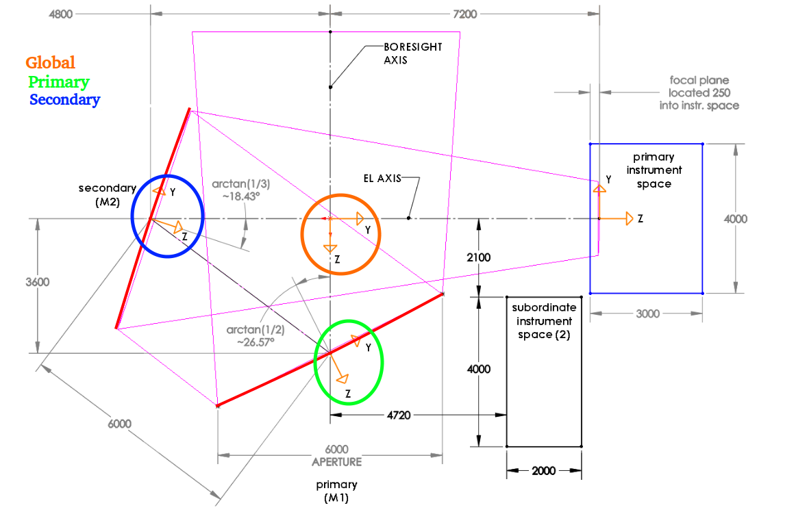

# LAT Alignment
Tools for LAT mirror alignment

## Usage
1. Create the appropriate directory structure for your measurement (see [File Structure](#file-structure) for details).
2. Place the measurement files in the appropriate place in your created directory (see [Measurement Files](#measurement-files) for details).
3. Create a file with any information about the measurement that could prove useful (see [Description File](#description-file) for details).
4. If required create a config file, alternatively pass these options as command line arguments (see [Config File](#config-file) for details).
5. Run the alignment script with `python alignment.py /PATH/TO/MEASUREMENT/DIRECTORY`
6. Follow the instructions in the output to align panels. This output will both be printed in the terminal and written to an output file (see [Output File](#output-file))

Run `python alignment.py -h` for details on the command line arguments, including optional ones.

### File Structure
Measurements should be organized in the following file structure
```
measurements
|
└───YYYYMMDD_num
|   |config.txt
|   |description.txt
|   |output.txt
|   |
|   └───M1
|   |   |XX-XXXXXX.txt
|   |   |XX-XXXXXX.txt
|   |   |...
|   |
|   └───M2
|       |XX-XXXXXX.txt
|       |XX-XXXXXX.txt
|       |...
|       
└───YYYYMMDD_num
|   |config.txt
|   |description.txt
|   |
|   └───M1
|   |   |XX-XXXXXX.txt
|   |   |XX-XXXXXX.txt
|   |   |...
|   |
|   └───M2
|       |XX-XXXXXX.txt
|       |XX-XXXXXX.txt
|       |...
|...
```

#### Measurement Directories
Each directory `YYYYMMDD_num` refers to a specific measurement session. Where `YYYYMMDD` refers to the date of the measurement and `num` refers to which number measurement on that date it was. For example the second measurement taken on January 1st, 2022 would be `20220101_02`.

This is the file path that should be provided to `alignment.py` as the `measurement_dir` argument.

#### Config File
The file `config.txt` contains configuration options. Each option should be on a new line and the delimiter between the option and its value is a tab.

Currently the only supported options are:

`coords`: The coordinate system that the measurement was taken in (see [Coordinate Systems](#coordinate-systems) for more information. Valid values are `global`, `primary`, and `secondary`.

`shift`: The shift in the origin from the coordinate system specified with `coords` in mm. Provide space separated values for the offsets in x, y, and z.

Note that the values in `config.txt` are overridden by command line arguments passed to `alignment.py`.

#### Description File
Each measurement directory should contain a file `description.txt` with information on the measurement. Any information that could provide useful context when looking at the measurement/alignment after the fact should be included here (ie: who performed the measurement, where the measurement was taken, etc.).

#### Output File
Output generated by `alignment.py`.

Note that this file gets overwritten when `alignment.py` is run, so if you want to store multiple copies with different configs or something rename them before rerunning `alignment.py`.

#### Mirror Directories
Directories containing the measurements files within each root measurements directory. `M1` contains the measurements for the primary mirror and `M2` contains the measurements for the secondary mirror. If you don't have measurements for one of the mirrors you do not need to create and empty directory for it.

#### Measurement Files
Files containing the point cloud measurements for a given panel. Should live in the mirror directory that the panel belongs to. Files should be named `XX-XXXXXX.txt` where `XX-XXXXXX` is the panel number. The numbering system is as follows:
* First four digits (`XX-XX`) are the telescope number. For the LAT this is `01-01`
* Fifth digit is the mirror number. This is `1` for the primary and `2` for the secondary.
* Sixth digit is the panel row
* Seventh digit is the panel column
* Eight digit is the panel number (current, spare, replacement, etc.)

## Coordinate Systems
The relevent coordinate systems are marked in the diagram below:



Where the orange circle marks the `global` coordinate system, the green circle marks the `primary` coordinate system, and the blue circle marks the `secondary` coordinate system.

All measurements should be done in one of these three coordinate systems modulo a known shift in the origin.

## Dependencies
This code requires Python 3 to run, it will not work with Python 2. 
The following python libraries are dependencies:
* `numpy`
* `scipy`
* `argparse`

## Bugs and Feature Requests
For low priority bugs and feature requests submit an issue on the [git repo](https://github.com/simonsobs/LAT_Alignment).

For higher priority issues (or questions that require an expedient answer) [email](mailto:haridas@sas.upenn.edu), Slack, or call me.

## Contributing
If you wish to contribute to this repository (either code or adding measurement files) contact me via [email](mailto:haridas@sas.upenn.edu) or Slack.

If you are contributing code please do so by creating a branch and submitting a pull request. Try to keep things as close to PEP8 as possible.
