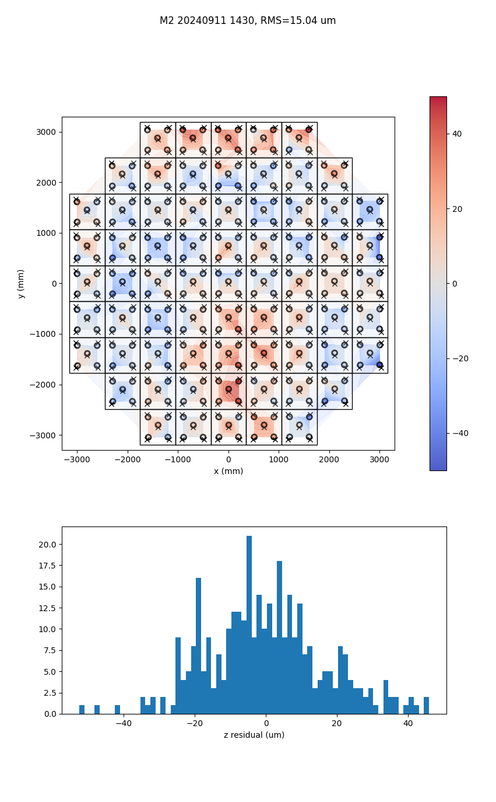

# Alignment Procedure

Here we describe the procedure for aligning the Simons Observatory (SO)
Large Aperture Telescope (LAT) using this software package to process
photogrammetry data taken using a [Geodetic Systems' V-Stars](https://www.geodetic.com/v-stars/) system.

With minor modifications these instructions and the software package could be generalized to other forms
of measurements (ie: a laser tracker). Generalizing to other telescopes is possible but more involved.
If you are interested in applying this software to other measurements or other telescopes please raise a
[GitHub issue](https://github.com/simonsobs/LAT_Alignment/issues) for help with that.

Before attempting and alignment it is useful to familiarize yourself with this relevant
[coordinate systems](https://simonsobs.github.io/LAT_Alignment/latest/coordinate_systems/)
and the package's [configuration file](https://simonsobs.github.io/LAT_Alignment/latest/config_file/).

### Reference Points

Something that is key for both alignment stages is the use of reference points
around the edges of the mirror and on the receiver.
These are used to provide an initial transformation from the arbitrary coordinates
that the photogrammetry measurements are in to a known coordinate system.
These reference points should be places in locations that do not move when panels are
installed (ie: around the edge of the mirror's back-up structure.
In order to identify these points known coded targets should be placed near the reference points.
Currently the locations of these points (in the "Vertex Global" coordinates) along with nearby
coded targets are hard coded [here](https://github.com/simonsobs/LAT_Alignment/blob/415d5ccad4d16aaf2ca267c21f762bf62b612ca4/lat_alignment/transforms.py#L28-L41),
in the future these will likely be replaced with a file that can be provided by the user for more flexibility.

## Panel Alignment

When aligning panels the code takes the following steps:

1. Use reference points to put the measurements in a know coordinate system
2. Transform to the mirror's internal coordinates in the ["Optical" coordinate system](https://simonsobs.github.io/LAT_Alignment/latest/coordinate_systems/#optical-coordinate-systems).
3. Remove measurements with high error
4. Find and remove spurious measurements (sometimes the photogrammetry software will accidently find the same target multiple times, only one of those locations is typically of good quality).
5. Fit the surface against the model in multiple iterations (10 by default). Each iteration we remove the common mode transform that all panels see when fit against the model. We also remove points that are far enough from the surface (after removing the common mode) that they seem to be outliers or measurements not of the mirror surface.
6. For each panel fit a transformation that describes how that panel deviates from the model.
7. Use the per panel transformations to estimate how each adjuster is, if we have a measurement sufficiently close to the surface above and adjuster is to used to compute a correction on top of the fit model.
8. Fit for how each adjuster must be moved to correct for the errors in each panel's location and shape. When we do this we model turning each adjuster as a rotation about the axis created by the adjacent adjusters. For small adjustments this is approximately the same as treating the adjusters as independent and simply moving them by their residuals. For large adjustments this is needed to correctly account for the interplay between adjusters.

!!! warning

    Note that due to the common mode removal in step 5 above, the overall position
    of the mirror is not gaurunteed to be correct, only the shape of the surface.
    However this step is needed in order to account for errors in the locations of the
    reference point and cannot be skipped. The optical element alignment is needed after
    panel alignment to account for this an ensure that the mirrors and the receiver
    are in the correct location relative to each other.

### Inputs

There are only two required inputs to do the panel alignment.

The first is a configuration file with the `mode` field set to `panel`,
see [here](https://simonsobs.github.io/LAT_Alignment/latest/config_file/#panel-alignment)
for an example.

The second is a photogrammetry measurement of the mirror we want to align panels for.
This measurement should only include measurements of one mirror and should have good
measurements of at least four reference points.

### Outputs

The software produces two outputs: a plot of the mirror surface residuals and a `csv` file with the desired adjustments.

The RMS in the title of the plot is the RMS of the residuals between the mirror model and
the photogrammetry measurements. Each circle on the upper plot represents a point
measured by photogrammetry and the grid shows the panel locations.
Additionally there are three layers of colors overlayed on the plot.
The colors within each circle show the residual at each measurement point,
these colors can be interpreted using the colorbar.
The low alpha background shows the residuals interpolated across the whole mirror,
this is to show large scale trends but due to the low alpha should not be directly
interpreted using the colorbar.
The contour withing each panel shows the residuals interpolated between any points measured
for that specific panel and show the errors in the shape of each panel as currently aligned,
these colors can be interpreted using the color bar.
The histogram below the surface plot shows the distribution of residuals for this measurement,
if we have aligned to the white noise limit of the measurement then we expect this to look
like a gaussian centered on 0.

The `csv` file contains the adjustments (and their associated uncertainties) for each panel
in the measurement. Each row follows the format of the output of
[`alignement.adjust_panel`](https://simonsobs.github.io/LAT_Alignment/latest/reference/alignment/#lat_alignment.alignment.adjust_panel).

## Optical Element Alignment

WIP! Check back later!
