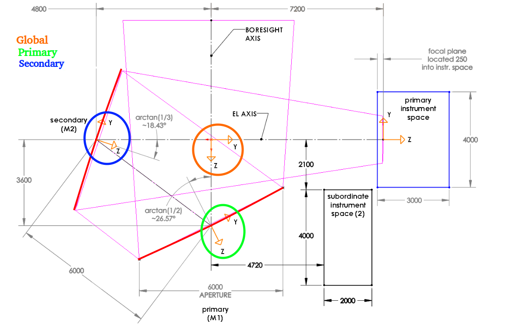
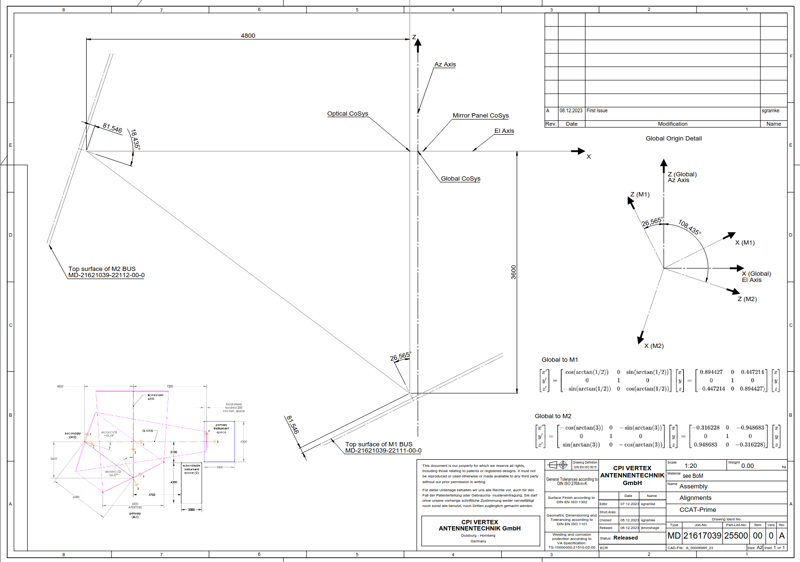

# Coordinate Systems

There are many coordinate systems that have been used to describe the
LAT mirror, most of them were used a single time and them replaced.
Here we describe the six coordinate systems that are actively used.
These six coordinate systems can be organized into two groups:
the "Optical" coordinate systems and the "Vertex" coordinate systems.
Each of these groups contains three coordinate systems: "Global", "Primary", and "Secondary";
where "Global" is a global reference frame for the whole telescope,
"Primary" is an internal reference frame for the primary mirror,
and "Secondary" is an internal reference frame for the secondary mirror.

In general this software package does all of its computations in the
"Optical" systems, but it is useful to understand the "Vertex" systems
so that one can utilize measurements provided by Vertex.

Note that this page is mostly to give the user an understanding of how
these coordinate systems are defined. You should never have to transform
between them by hand. For that please use the
[`transforms.coord_transform`](https://simonsobs.github.io/LAT_Alignment/latest/reference/transforms/#lat_alignment.transforms.coord_transform) function.

### Optical Coordinate Systems

The optical coordinate systems are designed to be logical given the optics of the telescope.

For "Primary" and "Secondary" the axis are defined such that:

* The $x$ axis changes as the panel column number changes.
* The $y$ axis changes as the panel row number changes.
* The $z$ axis is normal to the mirror surfaces.

And the origin is at the center of the mirror surface.
The mirror model in [`mirror.mirror_surface`](https://simonsobs.github.io/LAT_Alignment/latest/reference/mirror/#lat_alignment.mirror.mirror_surface)
is computed in these coordinates.

The directions of the axis relative to the mirror surface is not the same for the two mirrors,
check the diagram below to see where they point.

The "Global" coordinate system is defined such that:

* The $x$ axis is tangent to the telescope's azimuth rotation.
* The $y$ axis points towards the receiver.
* The $z$ axis points in the direction that light enters the telescope.

And the origin is set so that the origin of the "Primary" system
lies along the "Global" $z$ axis and the origin of the "Secondary"
system lies along the "Global" $y$ axis.

### Vertex Coordinate Systems

The vertex coordinate systems were developed by Vertex and are used for all of there
alignment purposes. If you get data from Vertex it is likely in this format.

For "Primary" and "Secondary" the axis are defined such that:

* The $x$ axis changes as the panel row number changes.
* The $y$ axis changes as the panel column number changes.
* The $z$ axis is normal to the mirror surfaces.

The origins are the same as in the "Optical" coordinate systems.
See the diagram below for the orientation of these axes.

The "Global" coordinate system is defined such that:

* The $x$ axis points towards the receiver.
* The $y$ axis is tangent to the telescope's azimuth rotation.
* The $z$ axis points out of the telescope.

The origin is offset by 120 mm along the "Vertex" $x$
(so the "Optical" $y$ axis). The reason for the offset
is unclear.

