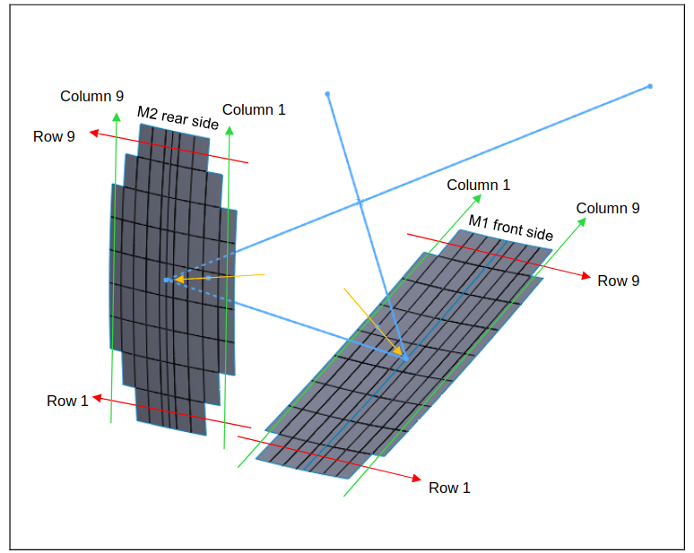
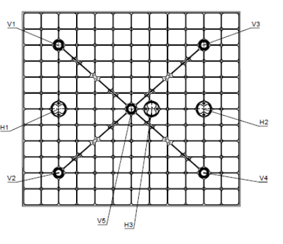

# Panel Numbering Scheme 

!!! info 

    Here we only describe the indexing and labeling of the mirror panels.
    For information on the optics of the mirrors please see
    [Parshley et al.](https://arxiv.org/abs/1807.06678).
    For more information on the optics of the SO LAT 
    [Dicker et al.](https://arxiv.org/abs/1808.05058) and
    [Gudmundsson et al.](https://arxiv.org/abs/2009.10138)
    are useful resources as well.

Each LAT mirror panel can be identified by a eight digit ID in the following format:

$$
(telescope number)(mirror number)(panel row)(panel column}(panel number)
$$

Where:

* $telescope number$ is a four digit ID for the telescope that the mirror belongs to with a hyphen between the second and third digit. The SO LAT is $01-01$.
* $mirror number$ is $1$ for the primary mirror and $2$ for the secondary mirror.
* $panel row$ is which row of the mirror the panel is in (see diagram below).
* $panel column$ is which column of the mirror the panel is in (see diagram below).
* $panel number$ identifies which instance of the panel you have, it can change to denote the creation of a spare or replacement panel.

Each panel has eight adjusters:

* Two $x$ adjusters (ie: moving the panel along its row) denoted as $H1$ and $H2$.
* One $y$ adjuster (ie: moving the panel along its column) denoted as $H3$.
* Five $z$ adjusters (ie: to deform the panel surface) denoted as $V1$ to $V5$.

The locations of these adjusters on the back of the panel can be seen below:

